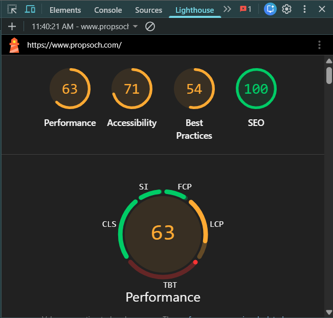
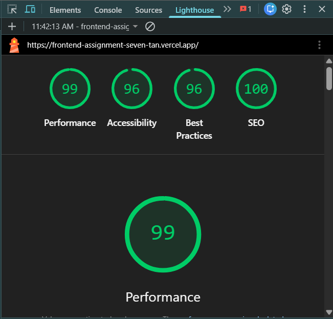

# Propsoch Landing Page Rebuild

A redesigned and optimized version of the Propsoch landing page built as part of a Frontend Engineering Assignment. The goal of this project was to analyze the existing website, identify UX/UI and performance issues, and create a faster, cleaner, and more accessible landing page using Next.js, TypeScript, and Tailwind CSS.

---

## Live Demo

https://frontend-assignment-seven-tan.vercel.app/

## GitHub Repository

https://github.com/aman2225/Frontend-Assignment

---

## Project Overview

The original Propsoch landing page had a strong concept, but there were several opportunities to improve performance, accessibility, mobile responsiveness, and overall visual hierarchy.

In this rebuild, I focused on:

- Redesigning the hero section to better communicate the value proposition
- Improving mobile navigation and responsiveness
- Optimizing images for faster loading
- Enhancing accessibility with semantic HTML and better contrast
- Simplifying call-to-actions to create a clearer user journey

## Lighthouse Audit Comparison

### Original Website


### Rebuilt Website



---

## Lighthouse Score Comparison

| Category | Original Website | Rebuilt Website |
|---------|----------------:|----------------:  |
| Performance |    63       |      99           |
| Accessibility |  71       |      96           |
| Best Practices | 54       |      96           |
| SEO |            100      |      100          |

---

## Key Issues Identified

### 1. Weak Hero Section
The original hero section lacked a strong visual hierarchy and did not clearly explain the product value.

### 2. Inconsistent Mobile Navigation
Navigation patterns were different on mobile and desktop, making the experience less intuitive.

### 3. Accessibility Problems
Some text had low contrast, and several buttons were missing descriptive labels.

### 4. Unoptimized Images
Large image files increased page load time and hurt performance.

### 5. Too Many CTAs
Multiple competing actions above the fold made the interface feel cluttered.

---

## Improvements Made

- Redesigned the hero section with a clearer headline and two focused CTAs
- Added trust statistics and supporting content sections
- Implemented a responsive sticky navigation header
- Converted images to WebP and used Next.js `Image` for optimization
- Improved accessibility with semantic HTML, alt text, and ARIA labels
- Reduced visual clutter and simplified the overall layout

---

## Sections Included

- Sticky Header
- Hero Section
- Trust Statistics
- Insights Section
- Buyer Journey
- Comparison Section
- Final CTA Section
- Footer

---

## Tech Stack

- Next.js 15
- TypeScript
- Tailwind CSS
- Lucide React
- Vercel

---

## Project Structure

```text
propsoch-landing-rebuild/
├── app/
│   ├── globals.css
│   ├── layout.tsx
│   └── page.tsx
├── public/
│   └── images/
├── next.config.ts
├── package.json
├── postcss.config.js
├── tailwind.config.ts
├── tsconfig.json
└── README.md
```

### Key Performance Improvements

- First Contentful Paint (FCP): **1.7s -> 0.9s**
- Largest Contentful Paint (LCP): **3.1s -> 1.6s**
- Total Blocking Time (TBT): **3,560ms -> 90ms**
- Speed Index: **2.7s -> 0.9s**

### Optimizations Applied

- Converted all images to WebP format
- Used Next.js `Image` component for responsive loading
- Enabled lazy loading for below-the-fold images
- Removed unnecessary scripts and dependencies
- Improved semantic HTML and accessibility
- Reduced JavaScript bundle size
